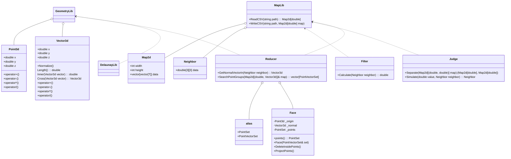

```mermaid
classDiagram
    class GeometryLib {

    }
    class Point3d {
        +double x
        +double y
        +double z
        +operator+()
        +operator-()
        +operator*()
        +operator/()
    }
    GeometryLib o-- Point3d
    class Vector3d {
        +double x
        +double y
        +double z
        +Normalize()
        Length(): double
        Inner(Vector3d vector): double
        Cross(Vector3d vector): Vector3d
        +operator+()
        +operator-()
        +operator*()
        +operator/()
    }
    GeometryLib o-- Vector3d
	class MapLib {
		+ReadCSV(string path): Map2d[double]
		+WriteCSV(string path, Map2d[double] map)
	}
    class Map2d {
        +int width
        +int height
        +vector[vector[T]] data
    }
    MapLib o-- Map2d
    class Neighbor {
        +double[3][3] data
    }
    MapLib o-- Neighbor
    class Filter {
        +Calculate(Neighbor neighbor): double
    }
    MapLib <.. Filter
    class Judge{
        +Separate(Map2d[(double, double)] map): (Map2d[double], Map2d[double])
        +Simulate(double value, Neighbor neighbor): Neighbor
    }
    MapLib <.. Judge
    class Reducer{
        +GetNormalVectorIn(Neighbor neighbor):Vector3d
        +SearchPointGroups(Map2d[(double, Vector3d)]& map): vector[PointVectorSet]
    }
    GeometryLib <.. Reducer
    MapLib <.. Reducer
    class Face {
        -Point3d _origin
        -Vector3d _normal
        -PointSet _points
        +points(): PointSet
        +Face(PointVectorSet& set)
        +DeleteInsidePoints()
        +ProjectPoints()
    }
    class alias {
        +PointSet
        +PointVectorSet
    }
    Reducer o-- alias
    Reducer o-- Face
    class DelaunayLib {

    }
    GeometryLib <.. DelaunayLib
```