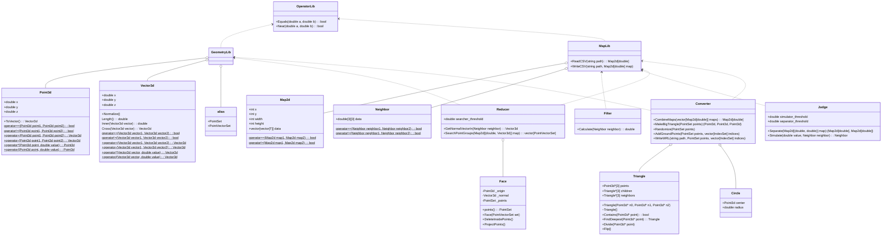

```mermaid
classDiagram
    class OperatorLib {
        +Equals(double a, double b): bool
        +Near(double a, double b): bool
    }

    class GeometryLib {

    }
    OperatorLib <.. GeometryLib

    class Point3d {
        +double x
        +double y
        +double z

        +ToVector(): Vector3d

        operator==(Point3d point1, Point3d point2)$: bool
        operator!=(Point3d point1, Point3d point2)$: bool

        +operator+(Point3d point1, Point3d point2)$: Vector3d
        +operator-(Point3d point1, Point3d point2)$: Vector3d
        +operator*(Point3d point, double value)$: Point3d
        +operator/(Point3d point, double value)$: Point3d
    }
    GeometryLib o-- Point3d

    class Vector3d {
        +double x
        +double y
        +double z

        +Normalize()

        Length(): double
        Inner(Vector3d vector): double
        Cross(Vector3d vector): Vector3d

        operator==(Vector3d vector1, Vector3d vector2)$: bool
        operator!=(Vector3d vector1, Vector3d vector2)$: bool

        +operator+(Vector3d vector1, Vector3d vector2)$: Vector3d
        +operator-(Vector3d vector1, Vector3d vector2)$: Vector3d
        +operator*(Vector3d vector, double value)$: Vector3d
        +operator/(Vector3d vector, double value)$: Vector3d
    }
    GeometryLib o-- Vector3d

    class alias {
        +PointSet
        +PointVectorSet
    }
    GeometryLib o-- alias

	class MapLib {
		+ReadCSV(string path): Map2d[double]
		+WriteCSV(string path, Map2d[double] map)
	}
    OperatorLib <.. MapLib

    class Map2d {
        +int x
        +int y
        +int width
        +int height
        +vector[vector[T]] data

        operator==(Map2d map1, Map2d map2)$: bool
        operator!=(Map2d map1, Map2d map2)$: bool
    }
    MapLib o-- Map2d

    class Neighbor {
        +double[3][3] data

        operator==(Neighbor neighbor1, Neighbor neighbor2)$: bool
        operator!=(Neighbor neighbor1, Neighbor neighbor2)$: bool
    }
    MapLib o-- Neighbor

    class Filter {
        +Calculate(Neighbor neighbor): double
    }
    MapLib <.. Filter

    class Judge{
        +double simulator_threshold
        +double separator_threshold

        +Separate(Map2d[(double, double)] map): (Map2d[double], Map2d[double])
        +Simulate(double value, Neighbor neighbor): Neighbor
    }
    MapLib <.. Judge

    class Reducer{
        +double searcher_threshold
        
        +GetNormalVectorIn(Neighbor neighbor): Vector3d
        +SearchPointGroups(Map2d[(double, Vector3d)] map): vector[PointVectorSet]
    }
    GeometryLib <.. Reducer
    MapLib <.. Reducer

    class Face {
        -Point3d _origin
        -Vector3d _normal
        -PointSet _points

        +points(): PointSet
        +Face(PointVectorSet set)
        +DeleteInsidePoints()
        +ProjectPoints()
    }
    Reducer o-- Face

    class Converter {
        +CombineMaps(vector[Map2d[double]] maps): Map2d[double]
        +MakeBigTriangle(PointSet points): (Point3d, Point3d, Point3d)
        +Randomize(PointSet points)
        +AddGroundPoints(PointSet points, vector[IndexSet] indices)
        +WriteWRL(string path, PointSet points, vector[IndexSet] indices)
    }
    MapLib <.. Converter
    GeometryLib <.. Converter

    class Triangle {
        +Point3d*[3] points
        +Triangle*[3] children
        +Triangle*[3] neighbors

        +Triangle(Point3d* n0, Point3d* n1, Point3d* n2)
        ~Triangle()

        +Contains(Point3d* point): bool
        +FindDeepest(Point3d* point): Triangle
        +Divide(Point3d* point)
        +Flip()
    }
    Converter o-- Triangle

    class Circle {
        +Point3d center
        +double radius
    }
    Converter o-- Circle
```